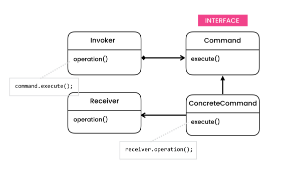

# The problem

- Let's say we want to queue operations, schedule their execution, execute them remotely or to implement reversible operations. Considering this situation, we'll need a stand-alone object that contains all the information about the operation.

# The solution

- The Command is a behavioral pattern, in which an object is used to encapsulate all information needed to perform an action or trigger an event latter time. 
- It aims to decouple the invoker from the receiver. With this structure, the invoker can talk to the receiver without being aware of it.
- This pattern makes our code extensible as we can add new commands without changing the existing code. However, increases the number of classes for each individual command.

# Structure

- **Invoker**
    - The Invoker class is responsible for initiating requests. This class must have a field for storing a reference to a command object. The invoker triggers that command instead of sending the request directly to the receiver. Note that the invoker isn’t responsible for creating the command object. Usually, it gets a pre-created command from the client via the constructor.
- **Command**
    - The Command interface usually declares just a single method for executing the command.
- **Concrete Command**
    - Concrete Commands implement various kinds of requests. A concrete command isn’t supposed to perform the work on its own, but rather to pass the call to one of the business logic objects. However, for the sake of simplifying the code, these classes can be merged.     
- **Receiver**
    -  The Receiver class contains some business logic. Almost any object may act as a receiver. Most commands only handle the details of how a request is passed to the receiver, while the receiver itself does the actual work.

## Command types

- **Composite Commands**
    -  Stores user actions and execute them later.
- **Undoable Commands**
    - Every command knows how to undo itself and, we do not have to store multiple snapshots of an object.

## Notes 
* *You can use Command and Memento together when implementing “undo”. In this case, commands are responsible for performing various operations over a target object, while mementos save the state of that object just before a command gets executed.*