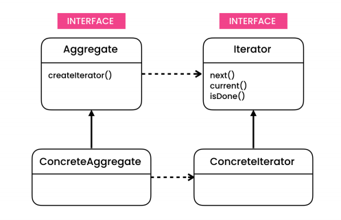

# The problem

- Nowadays, we verify that collections provide different ways of accessing their elements. As a result, you have no option other than to couple your code to the specific collection classes.

# The solution

- Iterator is a behavioral design pattern that lets you traverse elements of a collection without exposing its underlying representation (list, stack, tree, etc.).

- Encapsulates the data structure used to store the collection.

- The Client works with both collections and iterators via their interfaces. This way the client isn’t coupled to concrete classes, allowing you to use various collections and iterators with the same client code.

# Structure

- **Iterator**: The Iterator interface declares the operations required for traversing a collection: fetching the next element, retrieving the current position, restarting iteration, etc.
- **IterableCollection**: The Collection declares one or multiple methods for getting iterators compatible with the collection. Note that the return type of the methods must be declared as the iterator interface so that the concrete collections can return various kinds of iterators.

- Typically, clients don’t create iterators on their own, but instead get them from collections. Yet, in certain cases, the client can create one directly; for example, when the client defines its own special iterator.