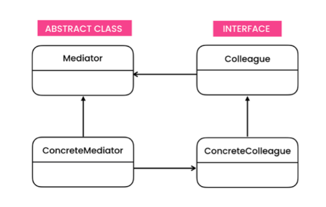

# The problem

- Having a dialog for creating and editing customer profiles, consists of various form controls such as text fields, checkboxes, buttons, etc. 

- As a result, having the logic implemented directly inside the code of the form elements, will make these elements’ classes much harder to reuse and maintain.

# The solution
- The mediator is a behavioral design pattern that lets you reduce chaotic dependencies between objects. The pattern restricts direct communications between the objects and forces them to collaborate only via a mediator object. 

- It suggests that you should cease all direct communication between the components which you want to make independent of each other. 

- Instead, these components must collaborate indirectly, by calling a special mediator object that redirects the calls to appropriate components. As a result, the components depend only on a single mediator class instead of being coupled to dozens of their colleagues.

# Structure

- **Mediator**
    - Abstract class which declares methods of communication with components, which usually include just a single notification method. We can use an interface if we do not need to share common behavior between different concrete mediators.
- **ConcreteMediator**
    - Encapsulates relations between various colleagues. Concrete mediators often keep references to all colleagues they manage and sometimes even manage their life cycle.
- **ConcreteColleague**
    - Colleagues are various classes that contain some business logic. Each component has a reference to a mediator, declared with the type of the mediator interface. The component isn’t aware of the actual class of the mediator, so you can reuse the component in other programs by linking it to a different mediator.

# Notes
- We need to be aware that over time the Mediator can evolve to a [God Object](https://en.wikipedia.org/wiki/God_object). To solve this problem, we can use the Observer Pattern.

- Use the Mediator pattern when it’s hard to change some of the classes because they are tightly coupled to a bunch of other classes.

- Facade and Mediator have similar jobs: they try to organize collaboration between lots of tightly coupled classes.

- *Single Responsibility Principle*
    - You can extract the communications between various components into a single place, making it easier to comprehend and maintain.
