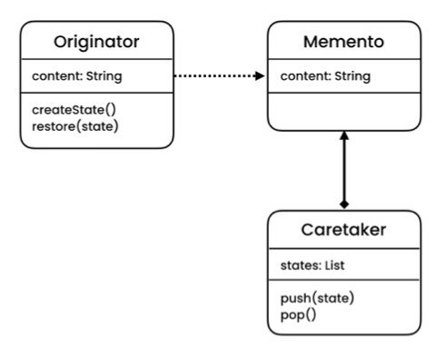

# The problem

- Imagine that you’re creating a text editor app. In addition to simple text editing, your editor can format text, insert inline images, etc.

- At some point, you decided to let users undo any operations carried out on the text.

- Making the TextEditor class responsible for undoing the operations, would violate the single responsibility principle.

# The solution

- The Memento pattern lets you make full copies of an object’s state, including private fields, and store them separately from the object. While most people remember this pattern thanks to the “undo” use case, it’s also indispensable when dealing with transactions.

- In other words, memento lets you save and restore the previous state of an object without revealing the details of its implementation.

# Structure

- **Originator**: The Originator class can produce snapshots of its own state, as well as restore its state from snapshots when needed.

- **Memento**: The Memento is a value object that acts as a snapshot of the originator’s state. It’s a common practice to make the memento immutable and pass it the data only once, via the constructor.

- **CareTaker**: The Caretaker knows not only “when” and “why” to capture the originator’s state, but also when the state should be restored.