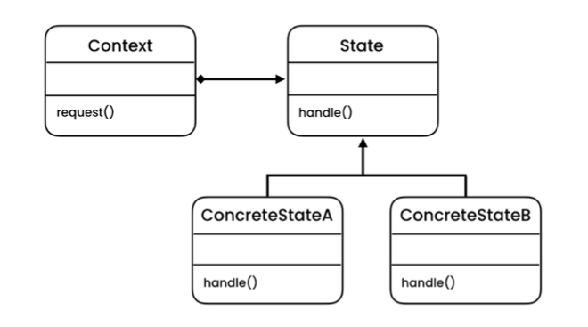

# The problem

- Let's say we have a document that can be in 3 different states: Draft, Moderation and Published.

- The publish method of the document works a little bit differently in each state.

- State machines are usually implemented with lots of conditional operators (if or switch) that select the appropriate behavior depending on the current state of the object.

- The biggest weakness of a state machine based on conditionals reveals itself once we start adding more and more states and state-dependent behaviors to the Document class. 

- Most methods will contain monstrous conditionals that pick the proper behavior of a method according to the current state.

# The solution

- The State is a behavioral design pattern that lets an object alter its behavior when its internal state changes. It appears as if the object changed its class. (Based on Polymorphism)

- We can support new functionalities, without changing the existing code, just by adding new classes.

- The State pattern suggests that you create new classes for all possible states of an object and extract all state-specific behaviors into these classes.

- Instead of implementing all behaviors on its own, the original object called context, stores a reference to one of the state objects that represents its current state, and delegates all the state-related work to that object.

# Structure

- **Context**: Context stores a reference to one of the concrete state objects and delegates to it all state-specific work. The context communicates with the state object via the state interface. The context exposes a setter for passing it a new state object.
- **State**: The State abstract class declares the state-specific methods. These methods should make sense for all concrete states because you don’t want some of your states to have useless methods that will never be called. We can use an interface, in case we do not have any common code to share between the concrete states.
- **ConcreteSate**: Provide their own implementations for the state-specific methods. To avoid duplication of similar code across multiple states, you may provide intermediate abstract classes that encapsulate some common behavior.

# Notes

- *Single Responsibility Principle*
    -  Organize the code related to particular states into separate classes.

-  *Open/Closed Principle*
    -  Introduce new states without changing existing state classes or the context.

- Simplify the code of the context by eliminating bulky state machine conditionals.

- Applying the pattern can be overkill if a state machine has only a few states or rarely changes.