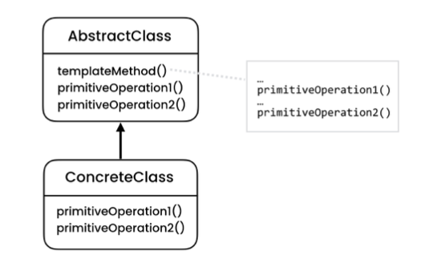

# The problem

- The Template pattern comes to solve situations where we have code replicated in different classes.

# The Solution

- It suggests that you break down an algorithm into a series of steps, turn these steps into methods, and put a series of calls to these methods inside a single “template method.” The steps may either be abstract or have some default implementation. To use the algorithm, the client is supposed to provide its own subclass, implement all abstract steps, and override some of the optional ones if needed (but not the template method itself).

- In other words, it is a behavioral design pattern that defines the skeleton of an algorithm in the superclass but lets subclasses override specific steps of the algorithm without changing its structure.

# Structure

- **AbstractClass**
    - Declares methods that act as steps of an algorithm, as well as the actual template method which calls these methods in a specific order. The steps may either be declared abstract or have some default implementation.
- **ConcreteClass**
    - It can override all of the steps, but not the template method itself.

# Notes

- Template Method is based on inheritance: it lets you alter parts of an algorithm by extending those parts in subclasses. The strategy is based on composition: you can alter parts of the object’s behavior by supplying it with different strategies that correspond to that behavior. Template Method works at the class level, so it’s static. The strategy works on the object level, letting you switch behaviors at runtime.