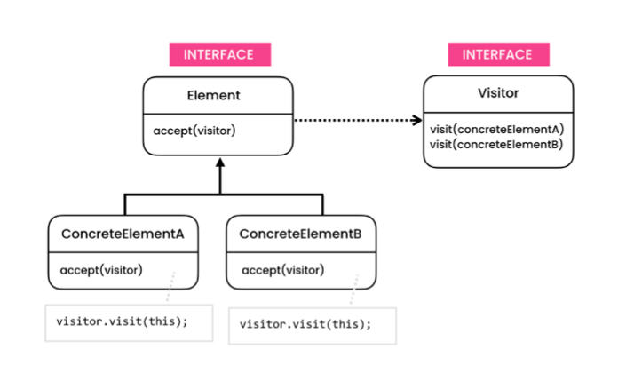

# The problem

- Every time we want to introduce an operation, we have to change every type in our object structure.

# The solution

- The Visitor is a behavioral design pattern that lets you separate algorithms from the objects on which they operate.

- The Visitor pattern suggests that you place the new behavior into a separate class called visitor, instead of trying to integrate it into existing classes. The original object that had to perform the behavior is now passed to one of the visitor’s methods as an argument, providing the method access to all necessary data contained within the object.

- We should use this approach if our object structure is stable, but we want to support new operations frequently.

- Every time we want to support a new operation the object structure we simply create a new class that implements the operational interface.

# Structure

- **Visitor**
    - The Visitor interface declares a set of visiting methods that can take concrete elements of an object structure as arguments. These methods may have the same names if the program is written in a language that supports overloading, but the type of their parameters must be different.
- **Concrete Visitor**
    - Each Concrete Visitor implements several versions of the same behaviors, tailored for different concrete element classes.
- **Element**
    - The Element interface declares a method for “accepting” visitors. This method should have one parameter declared with the type of the visitor interface.
- **Concrete Element**
    - Each Concrete Element must implement the acceptance method. The purpose of this method is to redirect the call to the proper visitor’s method corresponding to the current element class. Be aware that even if a base element class implements this method, all subclasses must still override this method in their own classes and call the appropriate method on the visitor object.

# Notes

- *Open/Closed Principle* 
    - You can introduce a new behavior that can work with objects of different classes without changing these classes.
-  *Single Responsibility Principle* 
    -  You can move multiple versions of the same behavior into the same class.
-  Visitors might lack the necessary access to the private fields and methods of the elements that they’re supposed to work with.
-  You need to update all visitors each time a class gets added to
or removed from the element hierarchy.