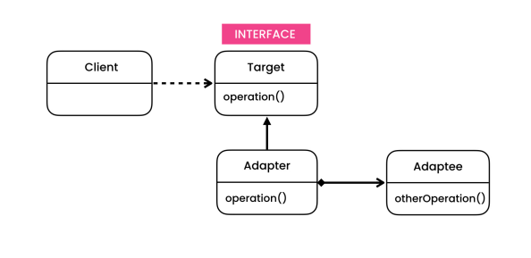

# The problem

- Let's say we want to convert the interface of one object so that another object can understand it.

# The solution

- The Adapter is a structural design pattern that allows objects with incompatible interfaces to collaborate. For example, when we import behavior from 3rd-party-library.

- We use this pattern to convert the interface of a class to a different form, just like how we use adapters in everyday life.

- An adapter wraps one of the objects to hide the complexity of conversion happening behind the scenes. The wrapped object isn’t even aware of the adapter. For example, you can wrap an object that operates in meters and kilometers with an adapter that converts all of the data to imperial units such as feet and miles.

- Adapters can not only convert data into various formats but can also help objects with different interfaces collaborate.

- We can use **Inheritance** or **Composition** to create the Adapter.

# Structure

- **Adpater**
    - The class that’s able to work with both the target and the adaptee: it implements the target interface while wrapping the adaptee object. The adapter receives calls from the client via the adapter interface and translates them into calls to the wrapped service object in a format it can understand.

# Notes

- The bridge is usually designed up-front, letting you develop parts of an application independently of each other. On the other hand, Adapter is commonly used with an existing app to make some otherwise-incompatible classes work together nicely.

- Facade defines a new interface for existing objects, whereas Adapter tries to make the existing interface usable. An adapter usually wraps just one object, while Facade works with an entire subsystem of objects.