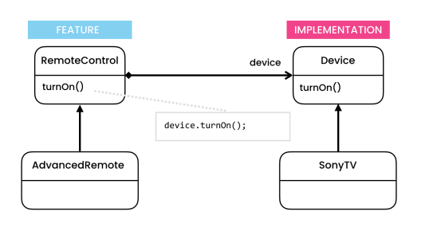

# The problem

- Let's say you have a geometric Shape class with a pair of subclasses: Circle and Square. And, you want to extend this class hierarchy to incorporate colors, so you plan to create Red and Blue shape subclasses.

- However, since you already have two subclasses, you’ll need to create four class combinations such as BlueCircle and RedSquare.

- Adding new shape types and colors to the hierarchy will grow it exponentially. 

# The solution

- The bridge pattern solves situations where we try to extend classes in two or more independent dimensions.

-  As a result, this pattern attempts to solve this problem by switching from inheritance to the object composition. What this means is that you extract one of the dimensions into a separate class hierarchy, so that the original classes will reference an object of the new hierarchy, instead of having all of its state and behaviors within one class.

- It lets you split a large class or a set of closely related classes into two separate hierarchies—abstraction and implementation—which can be developed independently of each other.

# Structure

- **Implementation**
    - Declares the interface that’s common for all concrete implementations. A Feature can only communicate with an implementation object via methods that are declared here.

- **Concrete Implementations**
    - It contains platform-specific code.

- **Feature**
    - It provides high-level control logic. It relies on the implementation object to do the actual low-level work.

# Notes

- *Open/Closed Principle*
    - You can introduce new abstractions and implementations independently from each other.
- *Single Responsibility Principle*
    - You can focus on high-level logic in the abstraction and on platform details in the implementation.