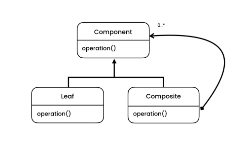

# The problem

- Let's say we have a hierarchy and we want to treat all the objects inside it in the same way. To solve this problem, we could use the Composite Pattern.

# The solution

- Composite is a structural design pattern that lets you compose objects into tree structures and then work with these structures as if they were individual objects.

- The greatest benefit of this approach is that you don’t need to care about the concrete classes of objects that compose the hierarchy. You don’t need to know whether an object is a simple object or a group of objects. You can treat them all the same via the common interface. When you call a method, the objects themselves pass the request down the hierarchy.

# Structure

- **Component**
    - The Component interface describes operations that are common to both simple and complex elements of the hierarchy.

- **Leaf**
    - The Leaf is a basic element of a tree that doesn’t have sub-elements. Usually, leaf components end up doing most of the real work, since they don’t have anyone to delegate the work to.

- **Composite**
    - The Container (aka composite) is an element that has sub-elements: leaves or other containers. A container doesn’t know the concrete classes of its children. It works with all sub-elements only via the component interface.

# Notes

- Use the Composite pattern when you have to implement a tree-like object structure.

- You can work with complex tree structures more conveniently: use polymorphism and recursion to your advantage.

- *Open/Closed Principle*
    - You can introduce new element types into the app without breaking the existing code, which now works with the object tree.