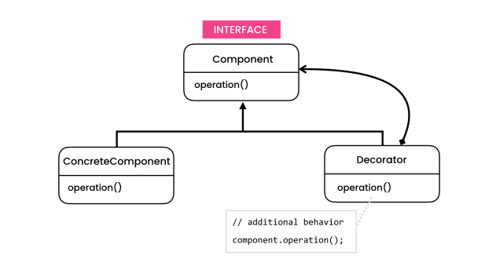

# The problem

- We should use the Decorator pattern when you need to be able to assign extra behaviors to objects at runtime without breaking the code that uses these objects.

# The solution

- The Decorator is a structural design pattern that lets you attach new behaviors to objects by placing these objects inside special wrapper objects that contain the behaviors.

- This pattern is kind of similar to implementing the adapter pattern. The difference between these two patterns is that with the adapter pattern, we change the interface of a class to a different form. In contrast, with the decorator pattern, we add additional behavior to an object.

# Structure

- **Component**
    - The Component declares the common interface for both wrappers and wrapped objects.
- **Decorator**
    - The class has a field for referencing a wrapped object. The field’s type should be declared as the component interface so it can contain both concrete components and decorators. The decorator delegates all operations to the wrapped object.

# Notes

- You can extend an object’s behavior without making a new subclass.

- You can add or remove responsibilities from an object at runtime.

- You can combine several behaviors by wrapping an object into multiple decorators.

- *Single Responsibility Principle*
    - You can divide a monolithic class that implements many possible variants of behavior into several smaller classes.