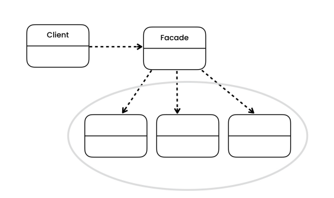

# The problem

- Imagine that you must make your code work with a broad set of objects that belong to a sophisticated library or framework. Ordinarily, you’d need to initialize all of those objects, keep track of dependencies, execute methods in the correct order, and so on. As a result, the business logic of your classes would become tightly coupled to the implementation details of 3rd-party classes, making it hard to comprehend and maintain.

# The solution

- The Facade is a structural design pattern that provides a simplified interface to a library, a framework, or any other complex set of classes.

- In other words, provides a simple interface to a complex subsystem that contains lots of moving parts. A facade might provide limited functionality in comparison to working with the subsystem directly. However, it includes only those features that clients really care about.

- Having a facade is handy when you need to integrate your app with a sophisticated library that has dozens of features, but you just need a tiny bit of its functionality.

# Structure

- **Facade**
    - The Facade provides convenient access to a particular part of the subsystem’s functionality. It knows where to direct the client’s request and how to operate all the moving parts.

# Notes

- You can isolate your code from the complexity of a subsystem.

- A facade can become a god object coupled to all classes of an app.

- Facade defines a new interface for existing objects, whereas Adapter tries to make the existing interface usable. An adapter usually wraps just one object, while Facade works with an entire subsystem of objects.

- Abstract Factory can serve as an alternative to Facade when you only want to hide the way the subsystem objects are created from the client code.