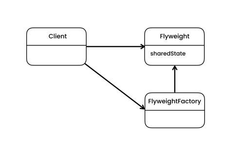

# The problem

- Let's say we have a set of objects which consume a lot of memory. We can reduce the memory occupied separating the intrinsic data, and creating a single instance of it, which will be shared across all the similar objects.

# The solution

- Flyweight is a structural design pattern that lets you fit more objects into the available amount of RAM by sharing common parts of the state between multiple objects instead of keeping all of the data in each object.

- Since the same flyweight object can be used in different contexts, you have to make sure that its state can’t be modified. A flyweight should initialize its state just once, via constructor parameters. It shouldn’t expose any setters or public fields to other objects.

- For more convenient access to various flyweights, you can create a factory method that manages a pool of existing flyweight objects. The method accepts the intrinsic state of the desired flyweight from a client, looks for an existing flyweight object matching this state, and returns it if it was found. If not, it creates a new flyweight and adds it to the pool.

- With the Flyweight pattern we need to separate the data that we need to share, and then implement a factory for caching this data. 

# Structure 

- **Flyweight**
    - It contains the portion of the original object’s state that can be shared between multiple objects. The same flyweight object can be used in many different contexts.

- **Flyweight Factory**
    - Manages a pool of existing flyweights. With the factory, clients don’t create flyweights directly. Instead, they call the factory, passing it bits of the intrinsic state of the desired flyweight. The factory looks over previously created flyweights and either return an existing one that matches search criteria or creates a new one if nothing is found.

# Notes

- Use the Flyweight pattern only when your program must support a huge number of objects which barely fit into available RAM.

- You can implement shared leaf nodes of the Composite tree as Flyweights to save some RAM.