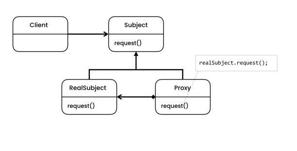

# The solution

- The proxy pattern, as the name implies, allows us to create a proxy or an agent for a real object. So if you want to talk to an object, you'll talk to it trough it's proxy or agent, this agent takes our message and forwards it to the target object.

- It lets you provide a substitute or placeholder for another object. A proxy controls access to the original object, allowing you to perform something either before or after the request gets through to the original object.

- Very useful to implement lazy loading.

- This pattern allows changing our application behavior by adding a new class, without modifying any existing code.

# Structure

- **Subject**
    - Declares the interface of the Service. The proxy must follow this interface to be able to disguise itself as a service object.

- **RealSubject**
    - The class provides some useful business logic.

- **Proxy**
    - It has a reference field that points to a real subject. After the proxy finishes its processing (e.g., lazy initialization, logging, access control, caching, etc.), it passes the request to the service object. Usually, proxies manage the full lifecycle of their service objects.

# Notes

- The facade is similar to Proxy in that both buffer a complex entity and initialize it on its own. Unlike Facade, Proxy has the same interface as its subject, which makes them interchangeable.

- Decorator and Proxy have similar structures, but very different intents. Both patterns are built on the composition principle, where one object is supposed to delegate some of the work to another. The difference is that a Proxy usually manages the life cycle of its RealSubject on its own, whereas the composition of Decorators is always controlled by the client.